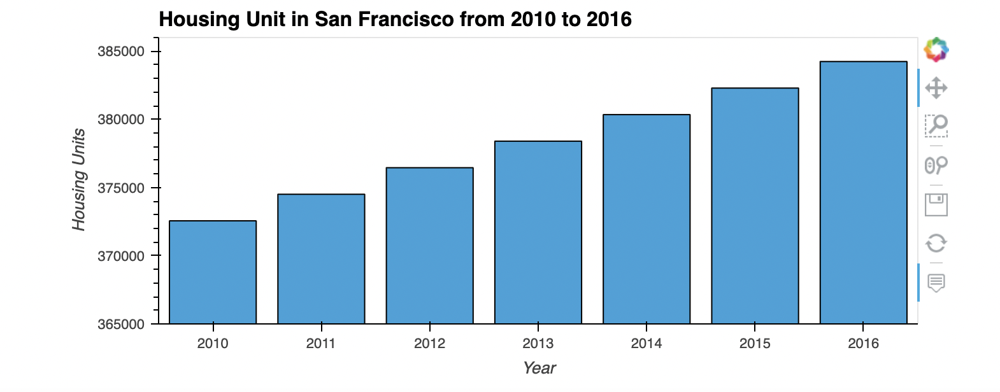
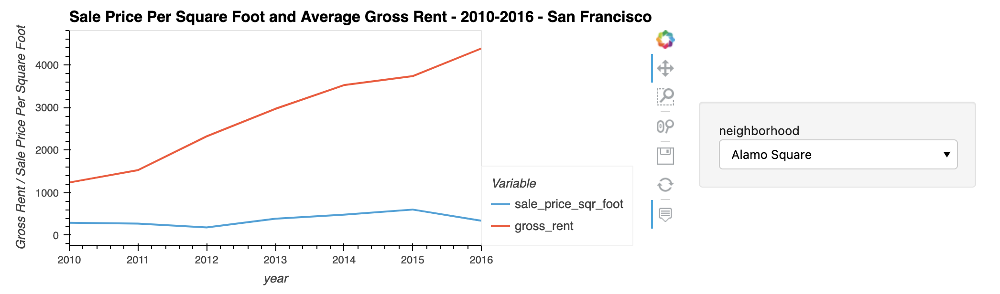
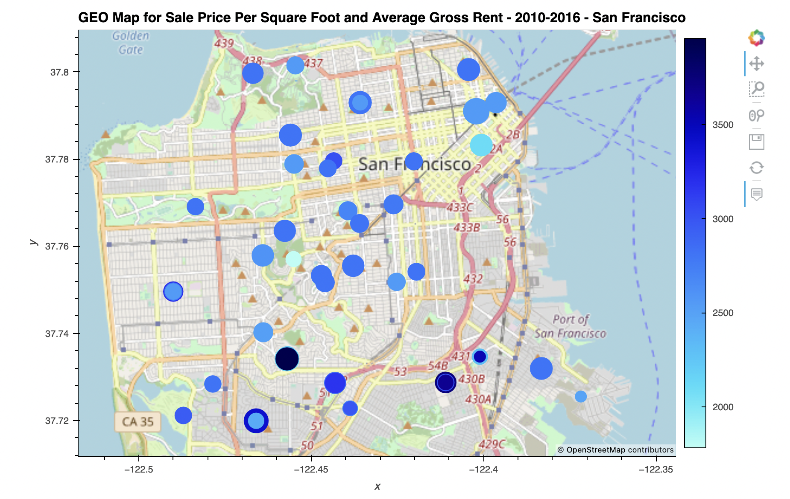

## san_francisco_housing

The **san_francisco_housing** uses data visualization, including aggregation, interactive visualizations, and geospatial analysis, to find properties in the San Francisco market that are viable investment opportunities.


## Technologies

This project leverages python 3.7.13 with the following packages:

* [pandas](https://pandas.pydata.org/) - For data analysis


---

## Installation Guide

Before running the application first install the pandas dependency in conda dev environment.

```python

    conda create -n dev python=3.7 anaconda

    python -m ipykernel install --user --name dev

    conda activate dev

    conda install pandas

    conda deactivate 
  
```

---


## Usage

To use the **san_francisco_housing** simply clone the repository and run the **san_francisco_housing.ipynb** with jupyter lab:

```python
    conda activate dev

    jupyter lab

    conda deactivate 
```

Plots of Housing Unit San Francisco, Sale Price Per Squar Foot and Average Gross Rent and GEO Map for Sale Price Per Square Foot and Average Gross Rent










---

## Contributors

Kausar Hina

---

## License

MIT
